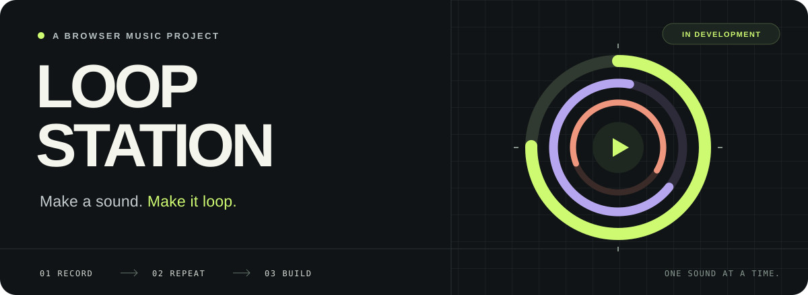

<p align="center">
  
</p>

<h3 align="center">작은 소리 하나에서 시작하는 음악.</h3>

<p align="center">
  목소리 하나, 짧은 비트 하나.<br />
  반복 위에 소리를 쌓아가는 브라우저 루프스테이션을 만들고 있습니다.
</p>

<p align="center">
  <code>Next.js 16</code> &nbsp;·&nbsp;
  <code>React 19</code> &nbsp;·&nbsp;
  <code>TypeScript</code> &nbsp;·&nbsp;
  <code>Tailwind CSS 4</code>
</p>

<p align="center">
  <a href="#quick-start">로컬에서 열어보기</a> &nbsp;↗&nbsp;
  <a href="docs/PROGRESS.md">개발 기록</a> &nbsp;↗&nbsp;
  <a href="docs/LOOP_STATION_SPEC.md">설계 노트</a>
</p>

<br />

## On the loop

흥얼거린 멜로디에 비트를 얹고, 그 위에 다음 소절을 더하는 경험.<br />
브라우저 안에서 녹음부터 연주, 저장까지 이어지는 작업 공간이 목표입니다.

| | 개발 흐름 |
| :--- | :--- |
| **지금** | 한국어 준비 화면, 박자·프레임 변환, 자동 검사 환경 |
| **다음** | 오디오 시작, AudioWorklet 연결, 마이크 권한과 환경 진단 |
| **그다음** | 첫 녹음과 루핑 → 여러 트랙과 오버더빙 → 로컬 저장과 WAV 내보내기 |

> **🚧 Under construction** — 현재 Phase 0을 진행 중입니다.<br />
> 실제 녹음·루핑·저장·클라우드는 아직 구현 전입니다. 자세한 상태는 [개발 기록](docs/PROGRESS.md)에 남깁니다.

## Quick start

**Node.js 24 LTS · npm 11**을 기준으로 시작합니다. Node.js 26도 허용합니다.

프로젝트 폴더에서:

```bash
npm ci
npm run dev
```

[localhost:3000](http://localhost:3000)에서 준비 화면을 확인할 수 있습니다.<br />
환경변수나 외부 계정은 필요하지 않습니다. nvm을 사용한다면 설치 전에 `nvm use`를 실행하세요.

<details>
<summary><strong>개발할 때 참고하기 — 검사 명령과 폴더 구조</strong></summary>

<br />

```bash
npm run lint
npm run typecheck
npm run test
npm run build

# 브라우저 검사: 빌드 후 실행
npx playwright install chromium
npm run test:e2e
```

E2E는 빌드된 앱을 전용 포트 `3108`에서 실행합니다. `npm run test:watch`로 단위 테스트를 관찰 모드에서 실행할 수 있습니다. 현재 `npm run test:audio`는 시간 변환 수치 테스트이며, 실제 마이크·DSP·Worklet 검증은 아직 포함하지 않습니다.

```text
src/app/                화면과 스타일
src/lib/i18n/           한국어 UI 문구
src/audio/transport/    박자와 오디오 프레임 변환
tests/                  단위 테스트와 브라우저 테스트
docs/                   설계 노트와 개발 기록
```

현재 `dev`와 `build`는 Next.js를 실행합니다. Worklet 빌드·watch 파이프라인은 실제 오디오 엔진 구현과 함께 추가할 예정입니다. 작업 규칙은 [AGENTS.md](AGENTS.md)를 참고하세요.

</details>

<br />

---

<p align="center">
  <sub>한 소절씩, 한 겹씩. &nbsp; Record. Repeat. Build.</sub>
</p>
